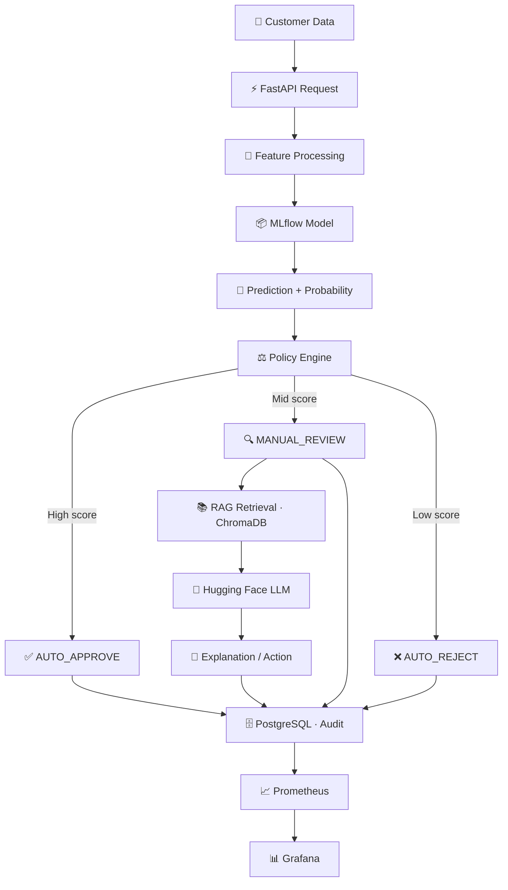

# 💳 Credit Risk Production System

<p align="center">
  
  
  
  
  
  
  
  
  
  
  
</p>

<p align="center">
  <b>Production-oriented credit-risk decisioning platform connecting ML, MLOps & LLMOps into one system.</b><br>
  ML produces the quantitative risk signal · Policy controls the business decision · LLM provides policy-grounded explanation
</p>

<p align="center">
  <a href="#-architecture">🏗️ Architecture</a> ·
  <a href="#-model-performance">📊 Performance</a> ·
  <a href="#-api-endpoints">🚀 API</a> ·
  <a href="#-development-roadmap">🗺️ Roadmap</a>
</p>

---

## 🎯 Production Goal

Move credit-risk ML and LLM/RAG work from experimentation into a **production-oriented AI platform** across three engineering areas:

| Area | Responsibility |
| :--- | :--- |
| **ML Engineering** | Build, package, evaluate & serve credit-risk models |
| **MLOps** | Model lifecycle, deployment, monitoring & automation |
| **LLMOps** | RAG, LLM deployment, evaluation, observability & integration |

> **Core principle:** The **ML layer** produces the quantitative prediction · The **policy layer** turns it into a business decision · The **RAG/LLM layer** provides policy-grounded explanation. The LLM never replaces the ML model as the source of the numerical risk score.

---

## 🏗️ Architecture



<details>
<summary><b>🧰 Tool responsibilities (click to expand)</b></summary>

| Tool | Role |
| :--- | :--- |
| Python / Scikit-learn / XGBoost | ML development |
| **MLflow** | ML tracking & model registry |
| **Kubeflow** | ML pipeline orchestration |
| **FastAPI** | Production API |
| **PostgreSQL 15 Alpine** | Application & audit database |
| **ChromaDB** | RAG vector store |
| **Hugging Face** | LLM deployment / inference |
| **Docker** | Containerization |
| **Kubernetes** | Production orchestration |
| **Prometheus** | Metrics collection |
| **Grafana** | Monitoring & visualization |
| **GitHub Actions** | CI/CD & model-serving automation |

</details>

---

## 📊 Model Performance

> ⚠️ **Note:** The unusually high evaluation results must be validated for trustworthiness before production selection.

| Rank | Model | Accuracy | F1 Score | ROC AUC | Status |
| :--: | :--- | :------: | :------: | :-----: | :----: |
| 🥇 | Gradient Boosting | **99.53%** | **99.53%** | 99.99% | 🟢 Production candidate |
| 🥈 | XGBoost | 99.52% | 99.52% | 99.99% | 🔵 Registered |
| 🥉 | Decision Tree | 99.46% | 99.46% | 99.91% | 🔵 Registered |
| 4 | Random Forest | 98.98% | 98.97% | 99.98% | 🔵 Registered |
| 5 | Logistic Regression | 96.81% | 96.72% | 98.85% | 🔵 Registered |
| 6 | KNN | 77.58% | 75.58% | 89.83% | 🔵 Registered |

Production selection considers: reliability · inference latency · model stability · probability quality · business cost · explainability · operational complexity.

<details>
<summary><b>🔁 MLflow model lifecycle (click to expand)</b></summary>

```text
model_bundle.joblib
        │
        ├── Logistic Regression     ├── Accuracy / Precision / Recall
        ├── Random Forest           ├── F1 Score / ROC AUC
        ├── Gradient Boosting       │
        ├── XGBoost                 └── Artifacts
        ├── KNN                         ├── model_bundle.joblib
        └── Decision Tree             ├── model_features.json
                 │                    ├── metadata.json
                 ▼                    ├── best_parameters.json
              MLflow                 ├── feature importance
                 │                    └── evaluation reports
        ┌────────┼────────┐
        ▼        ▼        ▼
     Metrics  Artifacts  Versions
                 │
                 ▼
           Model Registry ──► FastAPI loads approved version only
```

</details>

---

## 🚀 API Endpoints

| Endpoint | Description |
| :--- | :--- |
| `GET /health` | Liveness probe |
| `GET /ready` | Readiness probe (model + DB + LLM) |
| `POST /api/v1/predict` | Raw prediction + class probabilities |
| `POST /api/v1/risk/score` | Standardized risk score (0–100) |
| `POST /api/v1/risk/decision` | Score → policy decision (`AUTO_APPROVE` / `MANUAL_REVIEW` / `AUTO_REJECT`) |
| `POST /api/v1/llm/explain` | RAG-grounded explanation for review cases |

<details>
<summary><b>🧾 Example: decision + LLM response structure</b></summary>

```json
{
  "risk_level": "MEDIUM_HIGH",
  "reason": [
    "Recent delinquency activity",
    "High credit utilization"
  ],
  "recommended_action": "MANUAL_REVIEW",
  "policy_references": [
    "Delinquency Classification"
  ]
}
```

> The ML score remains the authoritative numerical prediction — the LLM response never becomes the source of the risk calculation.

</details>

---

## ⚖️ Decision Engine

```text
                 ML Model
                    ↓
            Risk Probability
                    ↓
             Policy Engine
                    ↓
       ┌────────────┼────────────┐
       ↓            ↓            ↓
 AUTO_APPROVE  MANUAL_REVIEW  AUTO_REJECT
                       │
                       ▼
                  RAG + LLM
```

This separation makes every decision **understandable and auditable**.

---

## 📈 Observability

| Layer | Metrics |
| :--- | :--- |
| **API** | Request count · error rate · latency · HTTP status |
| **ML** | Prediction volume · model version · inference latency · prediction distribution |
| **Decision** | `AUTO_APPROVE` / `MANUAL_REVIEW` / `AUTO_REJECT` rates |
| **LLM** | Requests · latency · errors · token usage · fallback count |

```text
Production Services → Prometheus → Grafana → Engineering Dashboard
```

---

## 🗺️ Development Roadmap

- [x] **Phase 1 — ML Production** · Validate `model_bundle.joblib` · Register 6 models in MLflow · Select production candidate
- [ ] **Phase 2 — API** · FastAPI app · Prediction & decision endpoints · MLflow integration · PostgreSQL persistence
- [ ] **Phase 3 — Decision Engine** · Policy rules · `AUTO_APPROVE` / `AUTO_REJECT` / `MANUAL_REVIEW`
- [ ] **Phase 4 — LLMOps** · ChromaDB + RAG · Hugging Face integration · Structured responses · Evaluation + interaction metadata
- [ ] **Phase 5 — Infrastructure** · Dockerize services · PostgreSQL 15 Alpine · Kubernetes deployment · Health checks
- [ ] **Phase 6 — Observability** · Prometheus metrics · Grafana dashboards · ML / decision / LLM monitoring
- [ ] **Phase 7 — CI/CD** · `ci.yaml` · `models_serving.yaml` · `cd.yaml` · Automated validation, builds & deployment

<details>
<summary><b>🔁 GitHub Actions workflow structure</b></summary>

```text
ci.yaml            models_serving.yaml        cd.yaml
─────────          ──────────────────         ─────────
Code               Model Change               GitHub
  ↓                  ↓                          ↓
Tests              Model Validation           Build
  ↓                  ↓                          ↓
Validation         MLflow                     Test
  ↓                  ↓                          ↓
Docker Build       Production Model           Docker Image
                      ↓                          ↓
                   Serving                   Kubernetes
                                                 ↓
                                            Production
```

</details>

---

## 🔐 Configuration

Sensitive configuration is managed via environment variables and deployment secrets — never committed to Git.

```bash
HUGGINGFACE_API_KEY=...
MLFLOW_TRACKING_URI=...
DATABASE_URL=...
POSTGRES_PASSWORD=...
```

<details>
<summary><b>📁 Project structure</b></summary>

```text
credit_risk_production/
├── app/
│   └── api/                        # FastAPI application
├── database/
│   └── LLM/
│       ├── chroma_store/           # RAG vector store
│       └── outputs_llm/
│           ├── llm_decisions.csv
│           ├── model_artifacts/
│           │   └── model_bundle.joblib   # 6-model bundle + preprocessing
│           ├── pipeline_manifest.json
│           └── rag_config.json
└── .github/
    ├── ci.yaml
    ├── cd.yaml
    └── models_serving.yaml
```

</details>

---

## 👥 Engineering Scope

<details>
<summary>🧑‍💻 <b>ML Engineer</b></summary>

Feature engineering, training, evaluation, packaging, and making the approved model available for inference. Also responsible for validating whether the current unusually high evaluation results are trustworthy before production selection.

</details>

<details>
<summary>⚙️ <b>MLOps Engineer</b></summary>

Makes the ML system **reproducible · deployable · observable · versioned · maintainable** — MLflow registry, Kubeflow orchestration, Docker, Kubernetes, GitHub Actions, Prometheus/Grafana.

</details>

<details>
<summary>🧠 <b>LLMOps Engineer</b></summary>

```text
RAG → ChromaDB → LLM → Hugging Face → Evaluation → Monitoring
```

Makes the LLM system **versioned · observable · reproducible · policy-grounded · safely integrated** with the ML decision system.

</details>

---

<p align="center">
  <b>Production principle:</b> ML produces the quantitative risk signal · the policy engine controls the business decision · the LLM provides policy-grounded explanation and assistance.
</p>
